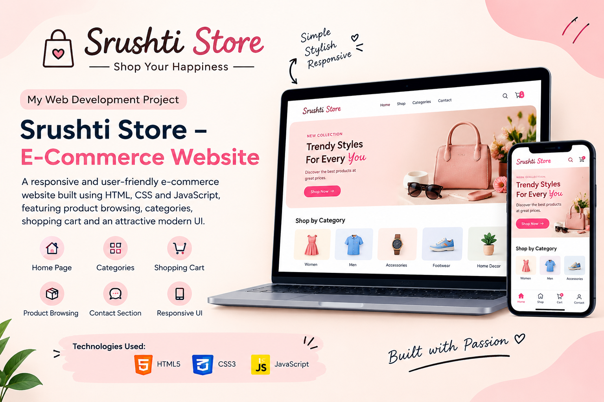

## 📸 Project Preview


# 🛍️ Srushti Store – E-Commerce Website

A responsive and user-friendly E-Commerce website developed using HTML, CSS, and JavaScript.

## 📌 About the Project

Srushti Store is a front-end E-Commerce website designed to provide a simple, attractive, and user-friendly online shopping experience.

## ✨ Features

- 🏠 Attractive Home Page
- 🛍️ Product Browsing
- 📂 Product Categories
- 🛒 Shopping Cart
- 📱 Responsive User Interface
- 📞 Contact Section
- 🎨 Modern and Clean Design

## 🛠️ Technologies Used

- HTML5
- CSS3
- JavaScript

## 📂 Project Structure

```text
srushti-store-ecommerce/
│
└── index.html
html
🚀 How to Run
Download or clone this repository.
Open the project folder.
Open index.html in any web browser.
Explore the Srushti Store website.
🎯 Project Objective

The main objective of this project is to practice front-end web development and create an interactive E-Commerce website using HTML, CSS, and JavaScript.

📚 Learning Outcomes

Through this project, I improved my skills in:

Web Development
HTML & CSS
JavaScript
User Interface Design
Responsive Web Design
Project Development
👩‍💻 Developer

Srushti Wakte

BCA Student | Aspiring Web Developer
